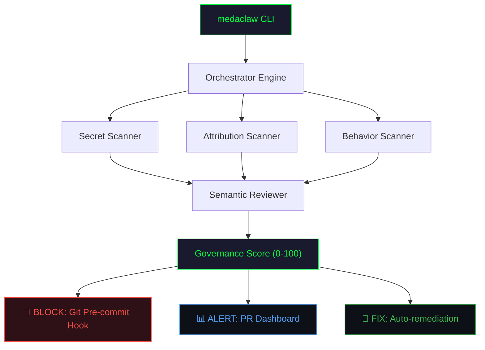

# 🦞 meda-claw

**Independent AI Security & Governance for Codebases**

[](https://github.com/VMaroon95/meda-claw/actions/workflows/medaclaw-ci.yml)
[](LICENSE)
[](https://www.python.org/downloads/)
[-brightgreen?style=flat-square)](demo/vulnerable_repo/)

> **"Who audits the AI that writes your code?"**
>
> As AI agents (Claude, Cursor, Copilot) take over the keyboard, traditional security tools fail to track **intent**. `meda-claw` is a forensic-first security layer providing automated risk scoring, provenance tracking, and commit-blocking.

📜 [Manifesto](MANIFESTO.md) · 🤝 [Contributing](CONTRIBUTING.md)

---

## The Sovereign Architecture



**Three scanners → Semantic review → Score → Action.**

| Scanner | Detects | Score Weight |
|---------|---------|-------------|
| **Secret Scanner** | AWS keys, GitHub tokens, Stripe keys, OpenAI keys, private keys, DB connection strings (14 patterns + entropy validation) | 40% |
| **Attribution Scanner** | AI-generated code without attestation, missing LICENSE, no provenance hooks | 30% |
| **Behavior Scanner** | `eval()`, `pickle.loads()`, shell injection, suspicious npm packages, missing `.gitignore` rules | 30% |

## The 60-Second Proof

```bash
# Install
pip install .

# Simulate a high-risk AI vulnerability
medaclaw simulate-attack

# Watch meda-claw find everything
medaclaw report ./vulnerable_project

# Auto-fix what it finds
medaclaw fix ./vulnerable_project
```

### Attack Simulation Output

```
  ╔══════════════════════════════════════╗
  ║                                      ║
  ║   AI GOVERNANCE SCORE:   18 / 100    ║
  ║   Grade: F  —  Failing               ║
  ║                                      ║
  ╚══════════════════════════════════════╝

  Score Breakdown:
    attribution    ████████░░░░░░░░░░░░ 13/30 (4 findings)
    permissions    ░░░░░░░░░░░░░░░░░░░░  0/40 (12 findings)
    behavior       ██████░░░░░░░░░░░░░░  5/30 (5 findings)

  Semantic Review:
    ⚡ 3 finding(s) escalated — authentication critical path
    🔐 AUTHENTICATION: auth/login.py
```

## Active Defense

Stop bad code before it leaves your machine:

```bash
medaclaw install-hooks --threshold 70
```

If a commit drops the Governance Score below 70, the commit is **automatically rejected**:

```
🦞 meda-claw: Running governance audit...
❌ meda-claw: Commit BLOCKED — Governance Score below 70.
   Run 'medaclaw report' to see findings.
   Run 'medaclaw fix' to auto-remediate.
```

## Auto-Remediation

`medaclaw fix` patches what it finds:

```bash
$ medaclaw fix ./project

  Current Score: 36/100 (Grade F)

  Available fixes (8):
    1. Replace hardcoded secret with environment variable in auth.py:11
       → Applied ✅
    2. Replace eval() with safe alternative in auth/session.py
       → Applied ✅
    3. Add missing entries to .gitignore
       → Applied ✅

  New Score: 72/100 (Grade C)
  Improvement: +36 points
```

## Commands

| Command | Description |
|---------|-------------|
| `medaclaw report [path]` | Full governance audit with scored findings |
| `medaclaw report --json [path]` | Machine-readable JSON for CI |
| `medaclaw report --threshold 70 [path]` | Fail if score below threshold |
| `medaclaw fix [path]` | Auto-remediate detected vulnerabilities |
| `medaclaw fix --dry-run [path]` | Preview fixes without applying |
| `medaclaw install-hooks` | Install pre-commit governance gate |
| `medaclaw simulate-attack` | Generate vulnerable project for demo |
| `medaclaw review [path]` | Semantic review with critical path analysis |
| `medaclaw review --pr [path]` | Concise PR comment format |
| `medaclaw sign [path]` | Create Human-Review Attestation |
| `medaclaw verify --full [path]` | Full governance posture check |
| `medaclaw scan [path]` | Quick secret + config scan |
| `medaclaw benchmark` | Proof-of-Audit (3 scenarios, 3 catches) |
| `medaclaw status` | Component health dashboard |

## AI Governance Score

```
Score = Attribution (30%) + Permissions (40%) + Behavior (30%)
```

| Severity | Penalty | Example |
|----------|---------|---------|
| Critical | -15 | Exposed AWS key, private key in source |
| High | -10 | DB connection string, unscoped API key |
| Medium | -5 | Test key in source, AI code without attestation |
| Low | -2 | Missing config, no git hooks |

| Grade | Score | Meaning |
|-------|-------|---------|
| A | 90-100 | Production-ready governance |
| B | 80-89 | Minor issues |
| C | 70-79 | Governance gaps |
| D | 50-69 | Significant risks |
| F | 0-49 | Critical failures |

## Human-Review Attestation

AI can assist. AI cannot self-govern. When AI contribution exceeds 50%:

```bash
medaclaw sign --reviewer "Your Name" --ai-pct 70 --notes "Reviewed scoring logic"
medaclaw verify --full .
```

Attestations are SHA-256 hash-chained. Tampering is detectable.

## CI/CD Integration

```yaml
# .github/workflows/medaclaw-ci.yml
name: Governance Scan
on: [push, pull_request]
jobs:
  scan:
    runs-on: ubuntu-latest
    steps:
      - uses: actions/checkout@v4
      - uses: actions/setup-python@v4
        with: { python-version: '3.10' }
      - run: pip install .
      - run: medaclaw report --json . > audit.json
      - run: medaclaw review --pr .
        if: github.event_name == 'pull_request'
```

## Architecture

```
meda-claw/
├── meda_claw/
│   ├── core/
│   │   ├── engine.py          # Orchestrator: Scan → Review → Score
│   │   ├── scoring.py         # Weighted 0-100 Governance Score
│   │   ├── findings.py        # Structured Finding + AuditReport
│   │   └── reviewer.py        # Critical path analysis + reasoning traces
│   ├── scanners/
│   │   ├── secrets.py         # 14 credential patterns + entropy
│   │   ├── attribution.py     # AI markers, attestation, license
│   │   └── behavior.py        # Dangerous patterns, deps, config
│   ├── policy/
│   │   ├── attestation.py     # Human-Review Attestation engine
│   │   └── governance_rules.json
│   ├── benchmarks/
│   │   └── proof_of_audit.py
│   └── cli.py                 # Click CLI (14 commands)
├── demo/vulnerable_repo/      # Deliberately insecure test project
├── .github/workflows/         # CI/CD template
├── MANIFESTO.md
├── CONTRIBUTING.md
└── LICENSE                    # AGPL-3.0
```

## Component Ecosystem

| Component | Focus |
|-----------|-------|
| [Agent-Audit](https://github.com/VMaroon95/Agent-Audit) | Real-time behavioral monitoring of AI agents |
| [Git_Provenance](https://github.com/VMaroon95/Git_Provenance) | AI attribution & IP compliance for Git |
| [API_Auditor](https://github.com/VMaroon95/API_Auditor) | API key permission scanning |
| [Repo_X-Ray](https://github.com/VMaroon95/Repo_X-Ray) | AST security scanner |
| [ExtensionGuard](https://github.com/VMaroon95/ExtensionGuard) | Browser endpoint security (Chrome Web Store) |
| [ProjectSpark](https://github.com/VMaroon95/ProjectSpark) | LLM evaluation & CLEAR Act compliance |
| [Push_Guardian](https://github.com/VMaroon95/Push_Guardian) | Push notification sanitization |

## License

AGPL-3.0 — see [LICENSE](LICENSE). Commercial licensing: varunmeda95@gmail.com

## Author

**Varun Meda** — [GitHub](https://github.com/VMaroon95) · [LinkedIn](https://linkedin.com/in/varunmeda1)
