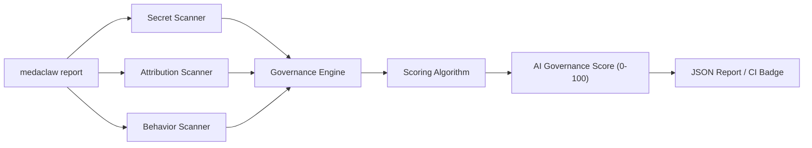

# 🦞 meda-claw

**Security observability for AI agents. One CLI. One score.**

Independent governance framework for autonomous AI systems — attribution tracking, secret detection, behavioral auditing, and policy enforcement. No vendor lock-in. No cloud dependencies. No telemetry.

[](https://www.python.org/downloads/)
[](LICENSE)

> 📜 Read the [Manifesto](MANIFESTO.md) · 🤝 [Contributing](CONTRIBUTING.md)

---

## How It Works



Three scanners feed structured findings into a scoring engine:

| Scanner | What It Detects | Score Weight |
|---------|----------------|-------------|
| **Secret Scanner** | AWS keys, GitHub tokens, Stripe keys, OpenAI keys, DB connection strings, private keys, bearer tokens | 40% (Permissions) |
| **Attribution Scanner** | AI-generated code without attestation, missing LICENSE, no provenance hooks | 30% (Attribution) |
| **Behavior Scanner** | Dangerous patterns (eval, pickle, shell injection), missing .gitignore rules, suspicious dependencies | 30% (Behavior) |

## Quick Start

```bash
pip install meda-claw
medaclaw report ./your-project
```

## Example Output

```
  ╔══════════════════════════════════════╗
  ║                                      ║
  ║   AI GOVERNANCE SCORE:   36 / 100    ║
  ║   Grade: F  —  Failing               ║
  ║                                      ║
  ╚══════════════════════════════════════╝

  Score Breakdown:
    attribution    ████████████░░░░░░░░ 18/30 (3 findings)
    permissions    ░░░░░░░░░░░░░░░░░░░░  0/40 (10 findings)
    behavior       ████████████░░░░░░░░ 18/30 (3 findings)

  Findings (16):
    🔴 [critical] AWS Access Key detected in auth.py:11
               → Rotate the key in AWS IAM console immediately.
    🔴 [critical] OpenAI API Key detected in auth.py:18
               → Rotate at platform.openai.com/api-keys.
    🟡 [  medium] AI-generated code without attestation: auth.py:1
               → Run `medaclaw sign` to create Human-Review Attestation.
```

## Commands

| Command | Description |
|---------|-------------|
| `medaclaw report [path]` | Full governance audit with scored findings |
| `medaclaw report --json [path]` | Machine-readable JSON output |
| `medaclaw scan [path]` | Quick secret + config scan |
| `medaclaw sign [path]` | Create Human-Review Attestation for AI-assisted code |
| `medaclaw verify [path]` | Validate attestation integrity and governance compliance |
| `medaclaw verify --full [path]` | Full governance posture check |
| `medaclaw audit [path]` | Behavioral + forensic audit (with Agent-Audit) |
| `medaclaw protect [path]` | Activate IP compliance + API key safeguards |
| `medaclaw init [path]` | Initialize governance (config, git hooks, directories) |
| `medaclaw benchmark` | Run Proof-of-Audit (3 scenarios, 3 catches) |
| `medaclaw status` | Component health dashboard |

## AI Governance Score

Weighted 0-100 metric. Higher is better.

```
Score = Attribution (30%) + Permissions (40%) + Behavior (30%)
```

Severity penalties per finding:

| Severity | Points Deducted | Example |
|----------|----------------|---------|
| Critical | -15 | Exposed AWS key, private key in source |
| High | -10 | Database connection string, unscoped API key |
| Medium | -5 | Test key in source, AI code without attestation |
| Low | -2 | Missing config, no git hooks |

| Grade | Score | Meaning |
|-------|-------|---------|
| A | 90-100 | Production-ready governance |
| B | 80-89 | Minor issues to address |
| C | 70-79 | Several governance gaps |
| D | 50-69 | Significant risks detected |
| F | 0-49 | Critical governance failures |

## Human-Review Attestation

AI can assist. AI cannot self-govern. When AI contribution exceeds 50%, `medaclaw sign` creates a cryptographic attestation:

```bash
$ medaclaw sign ./project --reviewer "Varun Meda" --ai-pct 70 --notes "Reviewed scoring logic"

  ✅ Attestation created
  Reviewer:       Varun Meda
  AI Contribution: 70.0%
  Commit:         05892e46cc87
  Hash:           4fdcb593a0dcdbbd...
```

Attestations are SHA-256 hash-chained. Tampering is detectable:

```bash
$ medaclaw verify --full ./project
  ✅ attestation_manifest      3 valid attestations, 0 tampered
```

## CI/CD Integration

Drop this into any GitHub repo:

```yaml
# .github/workflows/medaclaw-ci.yml
name: Governance Scan
on: [push, pull_request]
jobs:
  scan:
    runs-on: ubuntu-latest
    steps:
      - uses: actions/checkout@v4
      - run: pip install meda-claw
      - run: medaclaw report --json . > audit.json
      - run: |
          SCORE=$(python3 -c "import json; print(json.load(open('audit.json'))['governance_score'])")
          echo "Governance Score: $SCORE/100"
          [ "$SCORE" -lt 50 ] && exit 1
```

## Proof of Audit

Don't trust — verify:

```bash
$ medaclaw benchmark

  ✅ Secret Exfiltration Detection    — 3/3 planted secrets caught
  ✅ Unsigned AI Commit Block         — Policy engine blocks unsigned AI-heavy commits
  ✅ Attestation Tampering Detection  — SHA-256 integrity check detects all modifications

  🎯 PERFECT SCORE — All threats detected.
```

## Demo

Test against a deliberately vulnerable repo included in the project:

```bash
git clone https://github.com/VMaroon95/meda-claw.git
cd meda-claw
pip install -e .
medaclaw report demo/vulnerable_repo
```

Expected: Score 36/F with 16 findings across all three scanner categories.

## Architecture

```
meda-claw/
├── meda_claw/
│   ├── core/
│   │   ├── engine.py       # Orchestrator — runs scanners, aggregates findings
│   │   ├── scoring.py      # Weighted 0-100 Governance Score algorithm
│   │   └── findings.py     # Structured Finding and AuditReport objects
│   ├── scanners/
│   │   ├── secrets.py      # 14 credential patterns + entropy validation
│   │   ├── attribution.py  # AI markers, attestation, license, hooks
│   │   └── behavior.py     # Dangerous patterns, deps, config hygiene
│   ├── benchmarks/
│   │   └── proof_of_audit.py
│   ├── policy.py           # Human-Review Attestation engine
│   └── cli.py              # Click-based CLI
├── demo/vulnerable_repo/   # Deliberately insecure test project
├── .github/workflows/      # CI/CD template
├── MANIFESTO.md
├── CONTRIBUTING.md
└── LICENSE                  # AGPL-3.0
```

## Component Ecosystem

meda-claw orchestrates standalone tools that also work independently:

| Component | What It Does |
|-----------|-------------|
| [Agent-Audit](https://github.com/VMaroon95/Agent-Audit) | Real-time behavioral monitoring of AI agents (Codex, Claude Code) |
| [Git_Provenance](https://github.com/VMaroon95/Git_Provenance) | AI attribution & IP compliance firewall for Git |
| [API_Auditor](https://github.com/VMaroon95/API_Auditor) | API key permission scanning & financial exposure analysis |
| [Repo_X-Ray](https://github.com/VMaroon95/Repo_X-Ray) | AST security scanner & dependency graph visualizer |
| [ExtensionGuard](https://github.com/VMaroon95/ExtensionGuard) | Browser endpoint security (Chrome Web Store) |
| [ProjectSpark](https://github.com/VMaroon95/ProjectSpark) | LLM evaluation & CLEAR Act compliance |
| [Push_Guardian](https://github.com/VMaroon95/Push_Guardian) | Push notification sanitization middleware |

## License

AGPL-3.0 — see [LICENSE](LICENSE). Commercial licensing available for enterprise/SaaS (varunmeda95@gmail.com).

## Author

**Varun Meda** — [GitHub](https://github.com/VMaroon95) · [LinkedIn](https://linkedin.com/in/varunmeda1)
